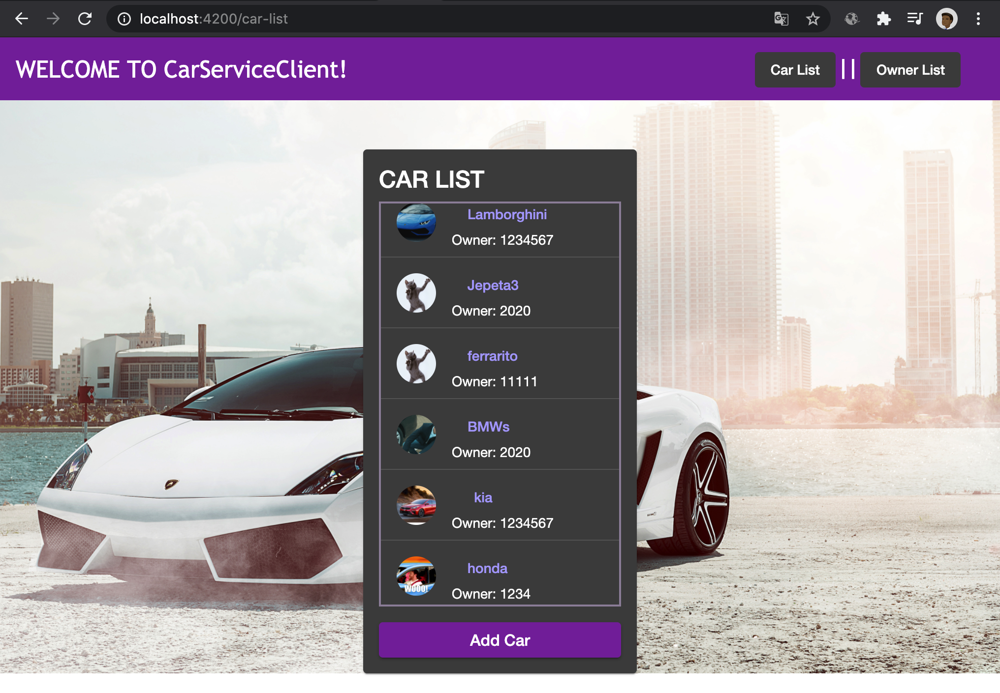

# CarServiceClient

This project was generated with [Angular CLI](https://github.com/angular/angular-cli) version 10.1.7.

# Result

# Used Components 
Was necesary to sued the the next component:
### 1) Car-edit :
This component manages the logical part and the view of the editing process of a vehicle, including the owner's ID.
### 2) Car-list :
This component manages the logical part and the view of the car listing process with its corresponding name, owner id and photo..
### 3) Owner-edition :
This component was used to implement the logic and the view of the editing process of the owners with their corresponding name and id. In addition to facilitating the update and deletion options.
### 4) Owner-list :
This component was used to implement the logic and the view of the listing process of the owners with their corresponding name and id. 

## Development server

Run `ng serve` for a dev server. Navigate to `http://localhost:4200/`. The app will automatically reload if you change any of the source files.

## Code scaffolding

Run `ng generate component component-name` to generate a new component. You can also use `ng generate directive|pipe|service|class|guard|interface|enum|module`.

## Build

Run `ng build` to build the project. The build artifacts will be stored in the `dist/` directory. Use the `--prod` flag for a production build.

## Running unit tests

Run `ng test` to execute the unit tests via [Karma](https://karma-runner.github.io).

## Running end-to-end tests

Run `ng e2e` to execute the end-to-end tests via [Protractor](http://www.protractortest.org/).

## Further help

To get more help on the Angular CLI use `ng help` or go check out the [Angular CLI README](https://github.com/angular/angular-cli/blob/master/README.md).
